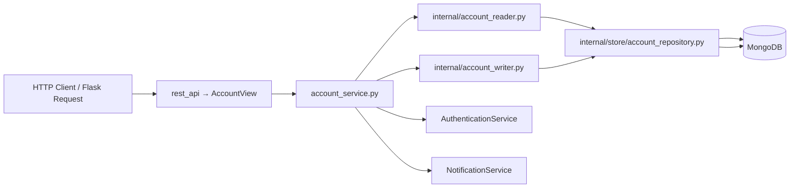

# Backend Architecture
> This repo just maintains the backend side of Excalidraw Project.

To go through whole project, these are the links:
* [ExcalidrawAI frontend](https://github.com/ayush-jhaaa/shaili_likes_frontend) 
* [ExcalidrawAI langchain](https://github.com/ayush-jhaaa/excalidrawAI_langgraph)

• AI-powered diagram generation and collaboration built on top of Excalidraw.

• Turn natural language prompts into structured diagrams, flows, architectures, and visual systems.

•Because apparently drawing boxes manually in 2026 is still considered productive engineering. :)

### This Docs covers:
        1) Modular Architecture of my backend
        2) Reason to use it
        3) Error handling
        4) Logging and debugging

### What's Modular architercture ?

Modular architecture is simply a architecture where a every feature is broken into small independent modules.

A **module** is a self-contained package of related functionality in our backend codebase. It encapsulates one domain concept (e.g., accounts, orders, payments) and exposes a clear interface for other parts of the system.

### Why Modular Architecture ?

- **Separation of Concerns**: Clearly divides HTTP routing, business logic, data access, and utilities into distinct layers.
- **Reusability**: Public-facing APIs (`account_service.ts`, `types.ts`) allow other modules to integrate without knowing internal details.
- **Testability**: Small, focused components (reader, writer, util) can be unit‑tested in isolation.
- **Consistency**: Applying the same pattern across modules speeds up onboarding and reduces cognitive load.
- **Scalability**: New features or entirely new domains can be added by copying the template and filling in domain specifics.

## 2. Concept & Layers Diagram

